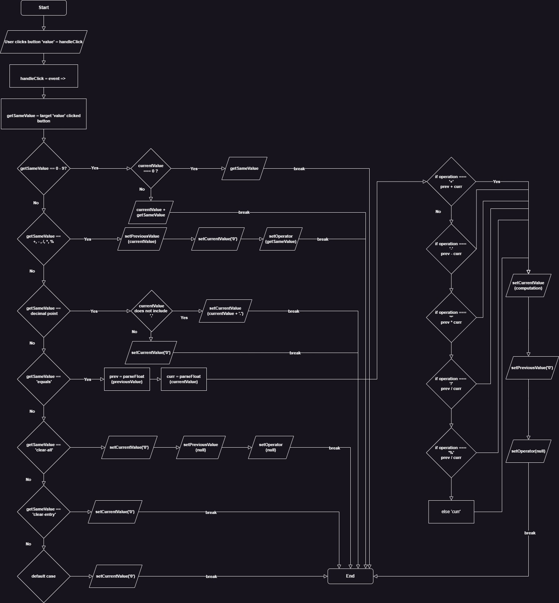
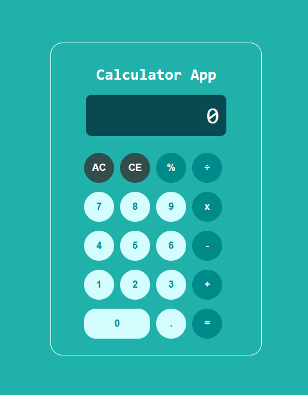

# Calculator App ReadMe | React
[toc]

This is an improvement of the Meta React Basics course calculator created as a final project: https://github.com/d31a/Cousera-Meta-CSS-HTML-FP

Although this calculator was functional, it wasn't very efficient, so the challenge was to create a functional calculator in React.

## Functionality
The previous calculator app did not take an input from a button to update the state, which I wanted for the functionality of this app.  

To begin with, I created a simple app that would `console.log` the button state when clicked. See here: https://github.com/d31a/react-button-state

Simply put, this app tracked the state of the button value when clicked using the `useState` hook. 

The result was as follows: 


## Logic flow

For the calculator app to be functional, the state would have to be tracked for three different object properies:

1. The value of the current clicked button
2. The value of the previously clicked button
3. The value of the selected operator (e.g. +, -, *, /)

The fuctionality of the app was mapped out using a logic flow diagram:



The most efficient way to achieve the calculator app would be to use a switch statement to determine: 

- Whether a numeric button was pressed (0-9)
- Whether an operator button was pressed
- Whether the decimal button was pressed 
- Whether the `=` button was pressed and
- Whether the user wanted to clear an entry

## Creating the logic
### The `useState` hook 
To code the calculator app, I expanded on the simple button state app, and created  variables from the `useState` hook to track state. 

In each of these the first variable holds the state, and the second updates the state. 

The first two, `currentValue` and `previousValue`, along side `setCurrentValue` and `setPreviousValue` keep track of curent value and previous value that a user presses. The last, `operation` and `setOperator` keep track of the operators pressed by the user in the calculator app. 

```
export default function Calc() {
  const [currentValue, setCurrentValue] = useState("0");
  const [previousValue, setPreviousValue] = useState("0");

  // Keeps track of the operation
  const [operation, setOperator] = useState(null);
  
  ```
  
 ### The `handleClick` event handler 
 
 The logic of the calculator app takes place within the `handleClick` event handler. 
 
 ```
  const handleClick = (e) => {
    const getSameValue = e.currentTarget.value;	
``` 
  
  What this essentially does is takes the value of the clicked button event and stores it in the `getSameValue` variable. 
  
 ### Switch statement 
 #### Numeric values 
 
 The main calculation of the app takes place in a switch statement that determines the value of the button inputted by the user by passing  `getSameValue` as the parameter. 
 
 **The first series of cases are the numeric values of 0-9:** 
 
 ``` 
 switch (getSameValue) {
      // Numbers
      case "0":
      case "1":
      case "2":
      case "3":
      case "4":
      case "5":
      case "6":
      case "7":
      case "8":
      case "9":
        setCurrentValue(
          currentValue === "0" ? getSameValue : currentValue + getSameValue
        );
        break;
 ``` 

Here, the `setCurrentValue` is updated with the value of the button pressed is `"0"` - `"9"`. Using an ES6 ternery operator, if the value set in the `currentValue` variable is strictly equal to "0", then the value of `getSameValue` will take that value and add no more to it. Else, if the value is any number 1-9, it will take the `currentValue` and add it on to `getSameValue`. 

In other words, if the value pressed is `9` while the current value is  `0`, then the output will be simply `9`. But if the value of the current value is `1`, and another number is inputted, such as `9`, then the output will be the numbers concatenated, e.g. `19`. This allows unlimited amont of numbers to output.

#### Operators 

The next series of cases are the calculator operators. 

 ```
// Calculator operations
      case "+":
      case "-":
      case "*":
      case "%":
        setPreviousValue(currentValue);
        setCurrentValue("0");
        setOperator(getSameValue);
        break;
```

These operators, apart from division, work the same.

For example, if a user were to click the `+` button on the calculator, the first thing that needs to happen is the value previously pressed by the user needs to be safely stored for later calculation. This is done by updating the state of the `setPreviousValue` object to the `currentValue`. 

In a simple calculation, like `x + y`, the operand of `x` would now be in the`setPreviousValue` state. The `currentValue` is now set to "0", ready for the operand of `y` to be inputted. 

Finally, the type of operator inputted by the user `(+, *, -, / )` is set in the setOperator variable by calling the `getSameValue` parameter. 

#### Division

Division works much like the other operators, but has additional error handling criteria to ensure that 0 is not divided by the user: 

 ```
// error handling for not dividing by 0
      case "/":
        if (currentValue === "0") {
          alert("Cannot divide by zero");
          break;
        }
        setPreviousValue(currentValue);
        setCurrentValue("0");
        setOperator(getSameValue);
        break;
```

#### Adding a decimal point 

An if statement determines if a decimal point is inputted by a user. If the `currentValue` does not include a decimal point, one will be concatenated alongside the `currentValue`.  Otherwise the calculator will ignore the input. This avoids duplicate decimal points. 

```
//If there is a decimal point
      case ".":
        if (!currentValue.includes(".")) {
          setCurrentValue(currentValue + ".");
        }
        break;
```


#### The calculation 

The calculation is determined when a user presses the `=` button. First, two variables are determined `prev` and `curr`. These take the values of `previousValue` and `currentValue` after being parsed to a floating decimal. 

This means that our two values of `x` and `y` are now a floating decimal data type and ready to be calculated.

 ```
// Calculating the result
      case "=":
        const prev = parseFloat(previousValue);
        const curr = parseFloat(currentValue);
		
```

Then the calculation takes place in a series of ternery if/else statmenets. Essentially this asks which value of `operation` is strictly equal to the operator value. For instance, if the operator pressed is the `+` sign, it will then take the value of our previous input number `x` and then add it to  the current value, `y`. 


```
const computation =
          operation === "+"
            ? prev + curr
            : operation === "-"
            ? prev - curr
            : operation === "*"
            ? prev * curr
            : operation === "/"
            ? prev / curr
            : operation === "%"
            ? prev % curr
            : curr;
     
```
 
 Finally, the value is outputted by setting the `setCurrentValue` to result of the `computation`. The `setPreviousValue`  and `setOperator` states are reset, ready to take more user input if required.
 
 ```
setCurrentValue(computation); // sets the value to the computation variable
 setPreviousValue("0"); // erases previous value
 setOperator(null); // erases the value of operator used
break;
```

#### Clearing last entry and clear all

For clearing an entry, the `setCurrentValue` is reset to `"0"`. 

For clearing all values, all values are reset:


 ```
// Clearing the results
      case "clearAll":
        setCurrentValue("0");
        setPreviousValue(null);
        setOperator(null);
        break;
```

#### Default case

The final and default case of the switch statement sets the setCurrentValue to null:

```
default:
        setCurrentValue(null);
        break;
```

## UI / UX 

After coding the logic, the buttons of the calculator app are assembled. This had to be both user-friendly, and visually appealing. 

The results are to be displayed at the top of the button area inside an HTML `<p>` element using a JSX expression of `{currentValue}`

```
 return (
    <div className="App">
      <h1>Calculator App</h1>
      {/*This outputs the value to a paragraph*/}
      <p id="resultScreen">{currentValue}</p>
```

To avoid the buttons trailing off the 'screen', the CSS rule of `overflow:hidden;` was added to the `#resultScreen` ID.


The buttons were then configured in 4 columns with 5 rows using `<div>` elements.

```
<div className="calcBtns" id="firstRow">
        <button value="clearAll" onClick={handleClick}>
          AC
        </button>
        <button value="clearEntry" onClick={handleClick}>
          CE
        </button>
        <button value="%" onClick={handleClick}>
          %
        </button>
        <button value="/" onClick={handleClick}>
          ÷
        </button>
      </div>
      <div className="calcBtns">
        <button value="7" onClick={handleClick}>
          7
        </button>
        <button value="8" onClick={handleClick}>
          8
        </button>
        <button value="9" onClick={handleClick}>
          9
        </button>
        <button value="*" onClick={handleClick}>
          x
        </button>
      </div>
      <div className="calcBtns">
        <button value="4" onClick={handleClick}>
          4
        </button>
        <button value="5" onClick={handleClick}>
          5
        </button>
        <button value="6" onClick={handleClick}>
          6
        </button>
        <button value="-" onClick={handleClick}>
          -
        </button>
      </div>
      <div className="calcBtns">
        <button value="1" onClick={handleClick}>
          1
        </button>
        <button value="2" onClick={handleClick}>
          2
        </button>
        <button value="3" onClick={handleClick}>
          3
        </button>
        <button value="+" onClick={handleClick}>
          +
        </button>
      </div>
      <div className="calcBtns">
        <button id="bigZero" value="0" onClick={handleClick}>
          0
        </button>
        <button value="." onClick={handleClick}>
          .
        </button>
        <button value="=" onClick={handleClick}>
          =
        </button>
      </div>
```

Each of these buttons call the `{handleClick}` event handler when clicked. The `value` of each button is taken by the event handler and stored in the `getSameValue` variable, whereupon the switch statement is executed.

Finally, some CSS was added to make the calculator visually appealing. In particular, `nth-child()` css rules were applied to add color to certain button elements for differentiation.

```
#firstRow button:nth-child(2),
#firstRow button:nth-child(1) {
  background-color: rgb(51, 77, 77);
  color: white;
  border: 0px solid;
}
```

## The result




